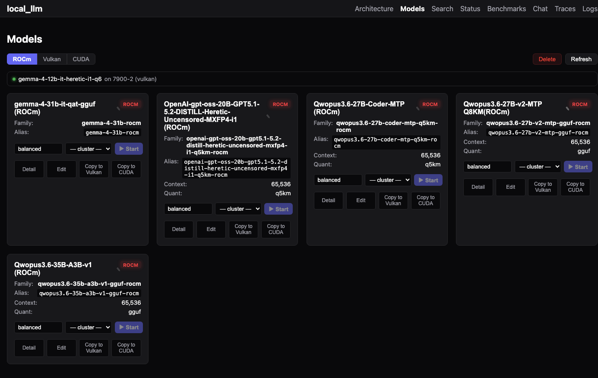
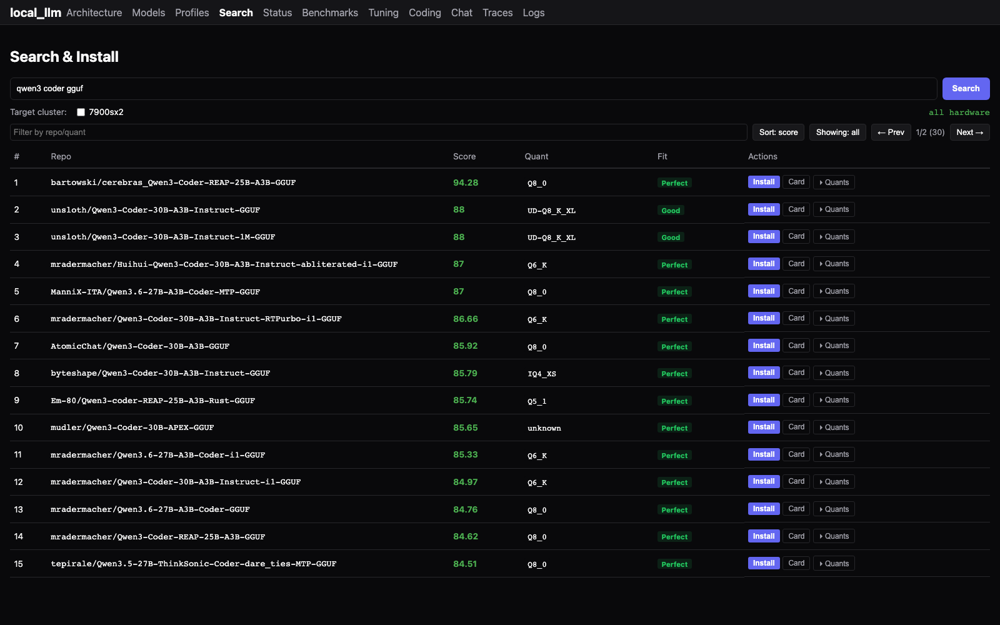
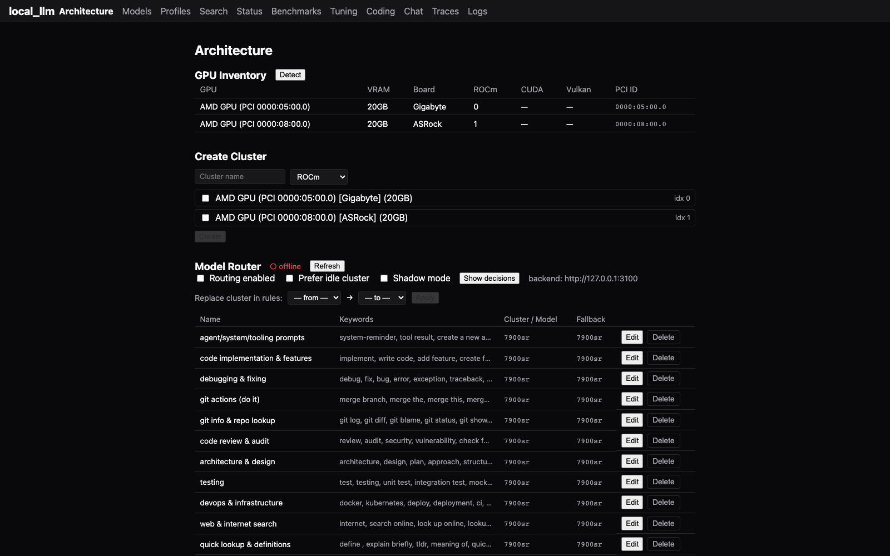
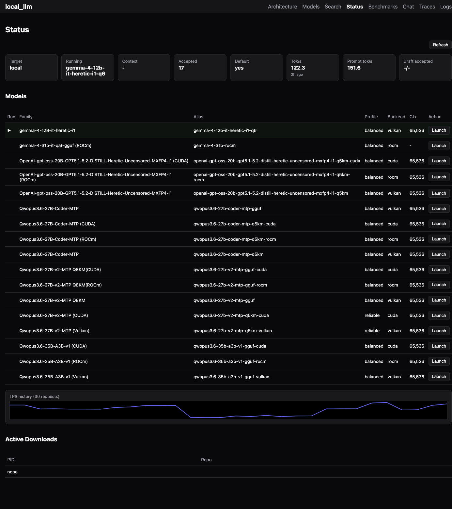
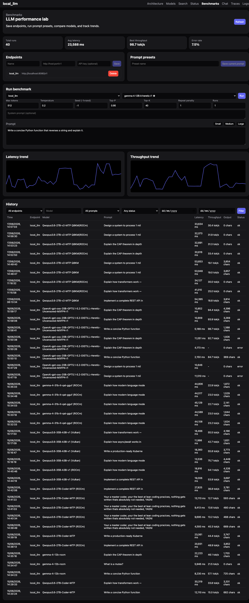
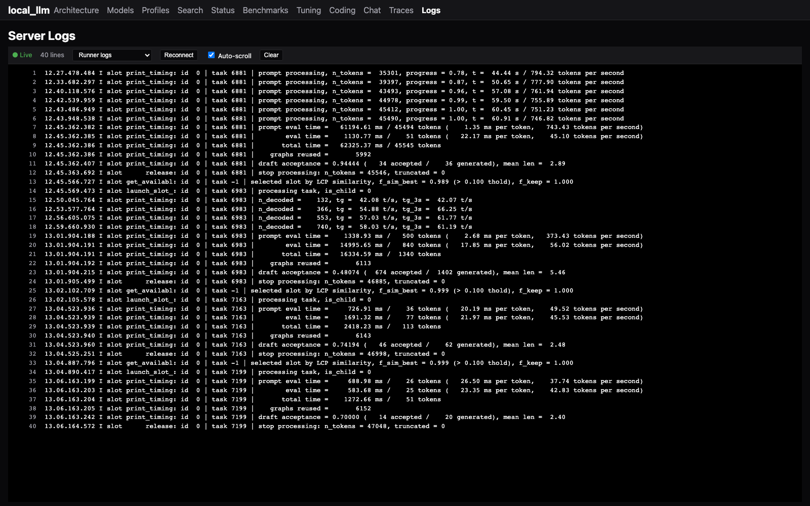
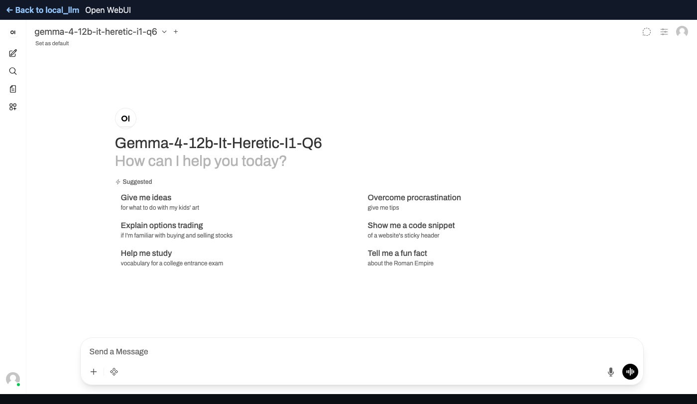
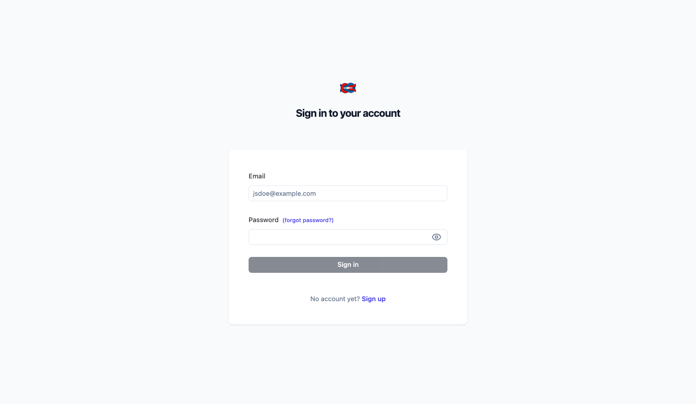

# local_llm

A self-hosted LLM management system for AMD and Nvidia GPU workstations. Models run in an isolated Docker container with full GPU access; a Svelte web UI handles search, install, configuration, model switching, benchmarking, chat, and observability.

## Screenshots

| Tab | Description |
|---|---|
| [](screenshot-models.png) | **Models** — browse installed models, view details, edit config, audit orphaned registrations |
| [](screenshot-search.png) | **Search** — discover and install GGUF models from HuggingFace |
| [](screenshot-architecture.png) | **Architecture** — system diagram, cluster management, profile selection when loading a model |
| **Profiles** | **Profiles** — named load configs per model family: edit raw JSON, clone, set default, import from models |
| [](screenshot-status.png) | **Status** — live TPS sparkline, runner health, active model, system stats, audit orphaned registrations |
| [](screenshot-benchmarks.png) | **Benchmarks** — run configurable benchmarks, view latency/throughput trends across runs |
| [](screenshot-logs.png) | **Logs** — real-time Docker container log streaming (runner, mgmt, router) |
| [](screenshot-chat.png) | **Chat** — Open WebUI full chat interface with model selection and conversation history |
| [](screenshot-traces.png) | **Traces** — Langfuse LLM request tracing: TTFT, token throughput, per-request timelines |

### Feature summary

- **Search and install** GGUF models from HuggingFace, downloading directly into the local HF cache.
- **Switch models** on demand — the management container creates and replaces the runner container via the Docker socket.
- **Edit model configs** — context size, batch, ngl, tensor split, flash attention, Jinja templates, MTP speculative decoding — without touching JSON by hand.
- **Profiles** — named load configurations per model family, stored in `profiles.json`. Select a profile when starting a model on a cluster. Edit as raw JSON, clone, set a default, or auto-seed from existing model configs. Profile fields (tensor split, context, flash attention, etc.) are merged into the launch metadata at start time.
- **Audit** — scan registered models against the HF cache; remove stale registrations whose GGUF files have been deleted from disk. Available on the Models and Status tabs.
- **Benchmark** models with configurable llama.cpp parameters (temperature, seed, top-p, top-k, repeat penalty, system prompt) and track latency/throughput trends across runs.
- **Terminal-Bench / SWE-bench** — run real agentic evals against any installed model: Terminal-Bench drives the `terminus-2` agent against real task containers, SWE-bench generates and evaluates a real patch against SWE-bench Lite instances. Pick a single task/instance or **run the entire dataset** for an aggregate `resolved/total` score to compare models. A live console tails harness output during the run, and a report link exposes the raw `results.json`/evaluation report afterward.
- **Chat** via Open WebUI at `/chat/` — full conversation UI with web search (SearXNG), model selection, history, and streaming.
- **Router** — keyword-based request router with live config reload, routing rules editor in the Architecture tab, and per-request routing audit. Open WebUI defaults to the `router` model so all chats are automatically dispatched to the best cluster.
- **Idle unload** — clusters auto-stop after a configurable idle timeout (5 min–2 hr) to save GPU power. Models reload automatically on the next request. Toggle and timeout in the Architecture tab.
- **Web search** — SearXNG container on `:3005` wired to Open WebUI. Enable per-chat with the 🌐 icon.
- **Stream logs** from the runner, management, or router containers in real time.
- **Monitor** TPS sparkline and runner slot health in the Status panel.
- **Trace** LLM requests with Langfuse: TTFT, token throughput, prompt/completion tokens, per-request timeline.

All model serving goes through the `local-llm-runner` Docker container. There are no host-side launcher scripts or systemd services for inference.

---

## Architecture

```
Browser
  │
  │  :3001  (Caddy)
  ▼
local-llm-caddy  ──/ui/*, /api/local-llm/*, /v1/*──▶  local-llm-mgmt    :3100
                 ──/*, /chat/*──────────────────────▶  open-webui         :3101
                 ──/traces*─────────────────────────▶  local-llm-langfuse :3004
  │
  │  local-llm-mgmt creates/stops cluster runners via Docker socket
  ▼
local-llm-router  :3200  (keyword router — dispatches to per-cluster runners)
  │
  ├── local-llm-runner-cluster-7900s  :8081  (ROCm, AMD 7900s)
  └── local-llm-runner-cluster-p40    :8082  (CUDA, Nvidia P40)
        │
        ├── GPU devices (ROCm /dev/kfd,/dev/dri or Nvidia device requests)
        └── ~/.cache/huggingface/hub  (GGUF model files)

open-webui  :3101  ──web search──▶  searxng  :3005
local-llm-langfuse  :3004  (LLM request tracing)
local-llm-postgres  :5433  (Langfuse database)
```

| Container | Port | Purpose |
|---|---|---|
| `local-llm-mgmt` | `3100` | FastAPI backend + Svelte UI. Manages models, launches runner. |
| `local-llm-runner` | `8080` | llama.cpp `llama-server`. Created on demand for the active model. |
| `local-llm-router` | `3200` | Keyword-based request router. OpenWebUI points here by default. |
| `local-llm-caddy` | `3001` | Reverse proxy. Single public entrypoint. |
| `open-webui` | `3101` | Full chat interface. Defaults to `router` model for automatic routing. |
| `searxng` | `3005` | Self-hosted web search for OpenWebUI. |
| `local-llm-langfuse` | `3004` | Langfuse v2 — LLM request tracing UI. |
| `local-llm-postgres` | `5433` | PostgreSQL for Langfuse (isolated from any other Postgres on the host). |

**State** lives outside the containers:

| Path | Purpose |
|---|---|
| `~/.local/share/local_llm/runs/accepted/` | Per-model JSON metadata (config, hf_repo, hf_file, etc.). |
| `~/.local/share/local_llm/profiles.json` | Named load profiles per model family. |
| `~/.local/share/local_llm/` | Runner state, benchmark and chat metrics databases. |
| `~/.cache/huggingface/hub/` | Downloaded GGUF files (shared between mgmt download and runner mount). |

---

## Setup

### Prerequisites

- Linux host with an AMD GPU (ROCm or Vulkan) and/or an Nvidia GPU (CUDA).
- Docker with Compose plugin.
- AMD: `/dev/kfd`, `/dev/dri` accessible to your user (render group).
- Nvidia: [nvidia-container-toolkit](https://github.com/NVIDIA/nvidia-container-toolkit) installed on the host so Docker can grant GPU device requests.

### 1. Configure

```bash
cp .env.example .env
# Verify RENDER_GROUP matches your system:
#   getent group render | cut -d: -f3
#
# Other variables use sensible defaults. See .env.example for each field's
# purpose and default value.
```

### 2. Build the runner images

```bash
cd runner && ./build.sh vulkan && ./build.sh rocm && ./build.sh cuda && cd ..
```

Each backend gets its own image — `local-llm-runner-vulkan:latest`, `local-llm-runner-rocm:latest`,
`local-llm-runner-cuda:latest` — built from `runner/<backend>/Dockerfile`. Only build the backends
your hardware supports; the build stage compiles llama.cpp from source for that backend, and the
runtime stage is stripped down to the binary and the GPU libs it needs.

### 3. Start everything

```bash
docker compose up -d
```

| Service | URL | Purpose |
|---|---|---|
| Management UI | http://localhost:3001/ui/ | Main interface |
| Open WebUI | http://localhost:3001/ | Full chat (optional) |
| Langfuse | http://localhost:3004/ | Request tracing |

To start without Open WebUI:

```bash
docker compose up -d local-llm-mgmt local-llm-caddy local-llm-postgres local-llm-langfuse
```

### 4. Langfuse first-time setup

On first start, go to `http://<host>:3004/`, register an account, create an org and project, then generate API keys under **Settings → API Keys**. Add the keys to `docker-compose.yml` under `local-llm-mgmt`:

```yaml
LANGFUSE_PUBLIC_KEY: "pk-lf-..."
LANGFUSE_SECRET_KEY: "sk-lf-..."
LANGFUSE_HOST: "http://localhost:3004"
```

Restart mgmt to pick them up: `docker compose up -d local-llm-mgmt`

If `LANGFUSE_PUBLIC_KEY` / `LANGFUSE_SECRET_KEY` are absent, tracing is silently disabled — everything else works normally.

### 5. Update

After pulling changes or editing the UI:

```bash
cd ui && bun run build && cd ..
docker compose build local-llm-mgmt
docker compose up -d local-llm-mgmt
```

---

## lltop

A terminal monitor for the local_llm stack. Shows GPU utilisation, VRAM, power, runner TPS, CPU temp, fan speeds, and system memory — all in one curses view, refreshing every 2 seconds.

The **Split / parallelism** panel answers what `rocm-smi`/`amd-smi` cannot: it reads DRM `fdinfo` inside each runner container (`/proc/1/fdinfo`), so per-GPU engine time and VRAM are attributed to the runner instead of the whole card. Aggregate occupancy is reported in GPU-equivalents — with `--split-mode layer` two cards each sit near 50% and the aggregate stays near `1.00 / 2.00`, i.e. a pipeline with no compute speedup, which whole-card busy% hides. `imbalance` is the spread between cards, useful for tuning `--tensor-split`.

```bash
cd lltop && ./install.sh          # installs to ~/.local/bin/lltop
lltop                             # run on the GPU host
```

---

## Usage

### Installing a model

1. Open **http://localhost:3001/ui/** → **Search** tab.
2. Enter a search query (e.g. `qwen 30b gguf`).
3. Click **Install** on a candidate. The model downloads into `~/.cache/huggingface/hub/`.

### Switching the active model

Go to **Models** tab. Click **Load** on any installed model. The management container:
1. Stops the current `local-llm-runner` container.
2. Waits for port 8080 to clear.
3. Creates a new `local-llm-runner` container with the correct model path, GPU env vars, and llama-server flags.
4. Waits up to 120 seconds for `/v1/models` to respond.

The UI shows a green dot when the runner is live.

### Editing a model config

**Models** → card menu → **Edit**. Fields map directly to llama-server args:

| Field | llama-server flag |
|---|---|
| ctx | `-c` |
| ngl | `-ngl` |
| batch / ubatch | `-b` / `-ub` |
| tensor split | `--tensor-split` |
| flash attention | `-fa on` |
| jinja templates | `--jinja` |
| speculative decoding | `--spec-type` + `--spec-draft-n-*` / `--spec-ngram-mod-*` |
| no_mmap | `--no-mmap` |
| mlock | `--mlock` |
| no_kv_offload | `--no-kv-offload` |
| numa | `--numa <value>` |
| main_gpu | `--main-gpu <index>` |
| threads / threads_batch | `-t` / `-tb` |
| flags | extra raw args appended verbatim |

Changes take effect on the next model switch.

### Profiles

**Profiles** tab. Select a model family, then select or create a named profile. Each profile is a raw JSON object of llama-server config fields — the same fields as the Edit form but unstructured, suitable for complex configs like dual-GPU tensor splits. Profiles are stored in `~/.local/share/local_llm/profiles.json`.

- **Import from models** — seeds all families from their current accepted model configs. Always overwrites.
- **Clone** — duplicate an existing profile under a new name.
- **Set default** — mark a profile as the one pre-selected when loading a model on a cluster.

When you start a model on a cluster in the **Architecture** tab, select a profile from the dropdown. The profile config is merged into the launch metadata before any cluster-specific GPU settings (visible devices, tensor split) are applied.

**Profile is the complete source of truth.** Only fields present in the profile are passed to llama-server — there are no hidden runtime defaults. What you see in the editor is exactly what runs.

**Editing a profile that's currently running restarts it.** Saving a profile (`PUT /api/profiles/{family}/{name}`) automatically relaunches any cluster currently running that family+profile, so the new config (e.g. a changed `context` window) takes effect immediately — you don't need to manually stop/start.

#### Single-GPU profile

```json
{
  "ngl": 999,
  "batch": 4096,
  "ubatch": 256,
  "context": 32768,
  "cache_prompt": true,
  "cache_ram": 16384,
  "context_shift": true,
  "ctx_checkpoints": 64,
  "checkpoint_min_step": 4096,
  "flash_attention": true,
  "reasoning": false,
  "repeat_penalty": 1.05,
  "presence_penalty": 0,
  "timeout": 600,
  "threads_http": 2,
  "parallel": 1,
  "no_cont_batching": true,
  "prio": 2,
  "no_warmup": true
}
```

#### Multi-GPU profile (two cards, layer split)

```json
{
  "ngl": 999,
  "split_mode": "layer",
  "tensor_split": "1,1",
  "visible_devices": "0,1",
  "batch": 4096,
  "ubatch": 256,
  "context": 65536,
  "cache_prompt": true,
  "cache_ram": 16384,
  "context_shift": true,
  "ctx_checkpoints": 64,
  "checkpoint_min_step": 4096,
  "flash_attention": true,
  "reasoning": false,
  "repeat_penalty": 1.05,
  "presence_penalty": 0,
  "timeout": 600,
  "threads_http": 2,
  "parallel": 1,
  "no_cont_batching": true,
  "prio": 2,
  "no_warmup": true
}
```

`tensor_split` is a comma-separated weight list — `"1,1"` distributes evenly across two GPUs. For unequal VRAM use ratios like `"2,1"`. `visible_devices` maps to `HIP_VISIBLE_DEVICES` / `CUDA_VISIBLE_DEVICES`. Use **Import from models** to seed profiles automatically from each model's current config.

#### ROCm/RCCL tensor profile (measured production shape)

```json
{
  "ngl": 999,
  "split_mode": "tensor",
  "tensor_split": "1,1",
  "batch": 4096,
  "ubatch": 512,
  "context": 92160,
  "cache_type_k": "f16",
  "cache_type_v": "f16",
  "flash_attention": true,
  "parallel": 1
}
```

Tensor mode needs a ROCm image built with RCCL and requires f16/bf16 KV. On the
measured 2× RX 7900 XT host, forcing hipBLAS in the image and using this 92k/512
shape reduced a representative request from 31.70 s (Vulkan layer) to
18.03–18.64 s. Larger ubatches were faster but unsafe at 92k due VRAM headroom.
See [ROCm/RCCL performance findings](docs/multi-gpu-parallelism-findings-2026-07-30.md#local-rccl-result).

#### All profile fields

Every field a profile can set, exactly as read by `container/backend/runtime.py` (`_config()`/`build_llama_server_args()`/`build_runner_container_spec()`). Fields not listed here are silently ignored — there are no hidden defaults, only what's shown is passed to `llama-server`.

| Field | Maps to | Notes |
|---|---|---|
| `ngl` | `-ngl` | Layers offloaded to GPU. `999` = all. |
| `split_mode` | `--split-mode` | `"layer"` (sequential pipeline), `"tensor"` (tensor parallel), or deprecated `"row"`. Tensor mode requires flash attention and f16/bf16 KV; ROCm collectives require an RCCL-enabled image. |
| `tensor_split` | `--tensor-split` | Comma-separated weights, e.g. `"1,1"`. |
| `ctx` | `-c` | Context size. Falls back to top-level `context` if `ctx` isn't set. |
| `batch` | `-b` | Logical batch size. |
| `ubatch` | `-ub` | Physical micro-batch size. |
| `reasoning` | `--reasoning on/off` | Falls back to top-level `reasoning` if unset in `config`. |
| `context_shift` | `--context-shift` | Boolean flag. |
| `cache_prompt` | `--cache-prompt --cache-ram <cache_ram>` | If false but `cache_ram` is set, only `--cache-ram` is passed. |
| `cache_ram` | `--cache-ram` | MB of RAM for the prompt cache. |
| `ctx_checkpoints` | `--ctx-checkpoints` | `0` disables; >0 also emits `checkpoint_min_step`. |
| `checkpoint_min_step` | `--checkpoint-min-step` | Only applied when `ctx_checkpoints > 0`. |
| `repeat_penalty` | `--repeat-penalty` | Also settable via `repetition_penalty` (same flag, alternate key). |
| `presence_penalty` | `--presence-penalty` | |
| `frequency_penalty` | `--frequency-penalty` | |
| `timeout` | `--timeout` | Request timeout, seconds. |
| `threads_http` | `--threads-http` | HTTP worker threads. |
| `parallel` | `--parallel` | Concurrent inference slots. Also drives benchmark worker counts. |
| `no_cont_batching` | `--no-cont-batching` | Boolean flag. |
| `prio` | `--prio` | Process scheduling priority. |
| `no_warmup` | `--no-warmup` | Boolean flag. |
| `mtp_enabled` | `--spec-type draft-mtp` | Shorthand: turns on MTP self-speculation when `spec_type` isn't set. See below. |
| `spec_type` | `--spec-type` | Comma-separated list, e.g. `draft-mtp`, `ngram-mod`, `draft-mtp,ngram-mod`, `draft-dflash`. Composes. |
| `mtp_draft_model` | `-md <path>` | Explicit draft model path. |
| `mtp_draft_hf_repo` / `mtp_draft_hf_file` | — | Resolves a draft model from the HF cache when `mtp_draft_model` isn't set directly. |
| `mtp_draft_n_max` | `--spec-draft-n-max` | |
| `mtp_draft_n_min` | `--spec-draft-n-min` | |
| `mtp_draft_p_min` | `--spec-draft-p-min` | |
| `ngram_mod_n_match` | `--spec-ngram-mod-n-match` | ngram lookup length. Values below 24 trigger a llama.cpp quality warning. |
| `ngram_mod_n_min` | `--spec-ngram-mod-n-min` | Should track `n_match`; leaving it at 0 costs ~20%. |
| `ngram_mod_n_max` | `--spec-ngram-mod-n-max` | Max drafted tokens per step. |
| `temperature` | `--temp` | |
| `top_p` | `--top-p` | |
| `top_k` | `--top-k` | |
| `min_p` | `--min-p` | |
| `cache_type_k` / `cache_type_v` | `--cache-type-k` / `-v` | KV cache quantization (e.g. `q8_0`). |
| `flash_attention` | `-fa on` | |
| `jinja` | `--jinja` | Use the model's Jinja chat template. |
| `no_mmap` | `--no-mmap` | |
| `mlock` | `--mlock` | |
| `no_kv_offload` | `--no-kv-offload` | |
| `numa` | `--numa <value>` | |
| `main_gpu` | `--main-gpu` | |
| `threads` | `-t` | |
| `threads_batch` | `-tb` | |
| `backend` | — | `"rocm"` (default), `"cuda"`, `"vulkan"`, or `"mixed_vulkan"`. Controls container device/runtime wiring, not a llama-server flag. |
| `visible_devices` | `HIP_VISIBLE_DEVICES` / `CUDA_VISIBLE_DEVICES` / `GGML_VK_VISIBLE_DEVICES` | Env var chosen based on `backend`. |
| `nvidia_vulkan` | — | Boolean; routes an NVIDIA GPU through the Vulkan backend via the nvidia container runtime. |
| `flags` | raw CLI args | Free-text extra flags appended verbatim. Any flag already covered by a promoted field above (`-fa`, `-md`, `--spec-*`, `--parallel`, `--cache-ram`, etc.) is stripped from here automatically so it isn't passed twice. |

**MTP/speculative-decoding note:** the only fields `runtime.py` actually reads are the flat `mtp_*` keys above. A nested `"mtp": {"enabled": true, ...}` object or raw-flag-named keys like `"draft-mtp"`/`"spec-draft-n-max"` are **not recognized** and are silently ignored — some profiles in `configs/profiles.json` currently have this stale shape and have no working MTP despite looking configured. Use the flat `mtp_*` keys for anything that needs to actually take effect.

**Choosing a `spec_type`.** The two mechanisms accelerate different things and compose:

- `ngram-mod` drafts by matching the last `n_match` tokens against the context and proposing what followed. Needs no draft model or MTP head, so it works on any model. Huge on output that echoes the context (file edits, refactors); does nothing for genuinely new text.
- `draft-mtp` drafts from the model's own hidden state via an MTP head, so it works on unseen output — the only lever that speeds up novel generation.

Measured on a 40B Q4_K_M across two 7900 XTs (decode t/s, edit-echo vs novel prose):

| spec config | echo/edit | novel |
|---|---|---|
| none | 17.9 | 18.0 |
| `ngram-mod` | 113.0 | 17.8 |
| `draft-mtp` | 29.9 | 19.9 |
| `draft-mtp,ngram-mod` | 117.5 | 20.7 |

Good defaults: `n_match`/`n_min` 24, `n_max` 86, `mtp_draft_n_max` 2. Leave `mtp_draft_p_min` unset on grafted MTP heads — their confidence isn't calibrated to the host model, and gating on it loses more than it saves. Depth above 2 degrades on grafts.

Two caveats worth knowing before enabling it everywhere. On CUDA the ngram half is not free: a P40 gained 2.6x on edits but lost 6.5% on novel prose, where the Vulkan cards lost nothing. And `--cache-reuse` is silently disabled both by a loaded `mmproj` and by any model whose context can't do KV shifting, so check the startup log for `cache_reuse ... will be disabled` rather than assuming the knob took.

### Audit

**Models** or **Status** → **Audit** button. Scans all registered model entries and checks whether their GGUF files still exist in the HF cache. Orphaned entries (file deleted from disk) are listed. Click **Remove N** to clean them up.

### Benchmarking

**Benchmarks** tab. Select a model from the installed list, set parameters, enter or generate a prompt, and run. Results are stored in SQLite and trend graphs update across runs. The model auto-switches if the selected model is not currently loaded.

#### Terminal-Bench / SWE-bench

The benchmark type selector in the Run panel switches from Standard prompt/response benchmarking to a real agentic eval:

- **terminal-bench** — runs the actual [Terminal-Bench](https://github.com/laude-institute/terminal-bench) harness with the `terminus-2` agent, pointed at your model via an OpenAI-compatible endpoint. Each task builds and runs its own Docker container.
- **swe-bench** — generates a real unified-diff patch from your model for a [SWE-bench Lite](https://www.swebench.com/) instance, then scores it with the actual `swebench` evaluation harness (build + test run in a per-instance Docker container).

For either type, pick a specific task/instance from the dropdown, or select **All N tasks** to run the entire dataset and get an aggregate `resolved/total` score — useful for comparing models against each other. Full-dataset runs are genuinely slow (each task/instance needs its own container build + eval), so expect terminal-bench-core (~80 tasks) or SWE-bench Lite (300 instances) to take hours, not minutes.

Runs execute as background jobs so they don't block the UI or the API; a live console below the Run panel tails the harness's real output while it's in progress, and a **report link** (in the console once done, and per-row in the History table) opens the raw `results.json` / swebench evaluation report. Run artifacts live under `$LOCAL_LLM_STATE_DIR/runs/benchmarks/{terminal_bench,swe_bench}/<run_id>/` so they survive container restarts.

Relevant environment variables: `TERMINAL_BENCH_DATASET_NAME` (default `terminal-bench-core`), `TERMINAL_BENCH_DATASET_VERSION` (default `0.1.1`), `SWE_BENCH_DATASET_NAME` (default `princeton-nlp/SWE-bench_Lite`), `SWE_BENCH_SPLIT` (default `test`), `SWE_BENCH_MAX_WORKERS` (default `1` for a single instance, `4` when running the full dataset).

### Chat

**Chat** link in the nav opens Open WebUI in the same tab with a back link.

### Traces

**Traces** link in the nav opens Langfuse in a new tab. Every chat completion (streaming and non-streaming) is traced with TTFT, duration, token counts, and TPS. Traces appear within seconds of a request completing.

### Router

The **Architecture** tab includes a router config editor for managing request routing. Requests sent with `model=auto` or `model=router` are matched against routing rules — the first matching rule's target cluster handles the request. Rules are evaluated in order.

Each rule can match on **keywords** (word-boundary substring match against the prompt) and/or **structural signals** that fire based on prompt shape rather than content:

| Signal | Fires when |
|---|---|
| `has_code_block` | Prompt contains a triple-backtick fence or 4-space-indented block |
| `has_math` | Prompt contains Unicode math symbols or LaTeX (`$...$`, `\frac`, `\sum`, etc.) |
| `long_prompt` | Prompt is more than 120 words |
| `short_prompt` | Prompt is fewer than 15 words |
| `is_question` | Prompt ends with `?` and is under 30 words |

A rule fires if any keyword **or** any signal matches. Signals complement keywords — a code block in the prompt routes to the code cluster even if no coding keywords appear in the text.

The router is a standalone container (`local-llm-router`) that reloads its config live when updated via the UI. Each routing decision is logged and visible in the **Logs** tab (router source) and in the Langfuse trace metadata. The matched keyword or signal (e.g. `signal:has_code_block`) is included in the log line.

Routing rules are stored in `configs/router_rules.json` in the git repo and bind-mounted into both the router and management containers. UI edits write directly to that file, so rule changes are always version-controlled — `git diff` on the server shows what changed.

Open WebUI defaults to the `router` model so all conversations are automatically dispatched to the appropriate cluster without manual model selection.

### Idle unload

In the **Architecture** tab, toggle **Auto-unload idle models** to automatically stop cluster runners after a period of inactivity. A dropdown lets you choose the timeout (5 min, 10 min, 15 min, 30 min, 1 hr, 2 hr). When a request arrives for an unloaded cluster, the model reloads automatically before the request is served. Desired state is preserved across unloads so the model comes back with the same configuration.

This is useful for reducing GPU idle power — a P40 with a model loaded draws ~50 W idle; unloaded it drops to ~10 W.

### Web search

Open WebUI has web search built in, powered by a local SearXNG container on `:3005`. Enable per-message with the 🌐 globe icon. SearXNG is configured to return JSON results with the bot limiter disabled so programmatic queries work. Web page fetching is bypassed in favour of search snippets to keep context small and response fast.

### Status

**Status** tab shows a live TPS sparkline (last 30 chat completions), runner slot health (idle/processing), and system stats from the Raspberry Pi agent if configured.

### Logs

**Logs** tab streams Docker container logs in real time. Toggle between the runner (`local-llm-runner`) and management (`local-llm-mgmt`) containers.

---

## Configuration

### Environment variables

| Variable | Default | Purpose |
|---|---|---|
| `LOCAL_LLM_UID` | `1000` | UID the management container runs as. Match your host user. |
| `LOCAL_LLM_GID` | `1000` | GID the management container runs as. Match your host group. |
| `HF_CACHE_DIR` | `${HOME}/.cache/huggingface/hub` | Host path to the HF GGUF cache (bind-mounted into runner). |
| `LOCAL_LLM_STATE_DIR` | `${HOME}/.local/share/local_llm` | Host path for accepted model metadata, state files, and benchmark DB. |
| `RUNNER_IMAGE_VULKAN` | `local-llm-runner-vulkan:latest` | Image used when launching a model with `backend: vulkan`. |
| `RUNNER_IMAGE_ROCM` | `local-llm-runner-rocm:latest` | Image used when launching a model with `backend: rocm`. |
| `RUNNER_IMAGE_CUDA` | `local-llm-runner-cuda:latest` | Image used when launching a model with `backend: cuda`. |
| `LOCAL_LLM_STATE_DIR` | `/state` | Accepted metadata and state files (container path). |
| `MODELS_CACHE_DIR` | `/models` | GGUF cache path inside the container. |
| `HOST_MODELS_CACHE_DIR` | same as above | Host-side path passed to the runner container bind mount. |
| `LLAMA_SERVER_PORT` | `8080` | Port the runner listens on. |
| `RENDER_GROUP` | `991` | GID of the render group — needed for GPU access. |
| `DOCKER_GROUP` | `107` | GID of the docker group — needed for Docker socket access. |
| `LOCAL_LLM_DISABLE_THINKING_BY_DEFAULT` | `false` | Inject `enable_thinking: false` into requests that don't explicitly set it. Prevents reasoning-only models from returning empty `content`. |
| `LANGFUSE_PUBLIC_KEY` | — | Langfuse project public key. Tracing disabled if absent. |
| `LANGFUSE_SECRET_KEY` | — | Langfuse project secret key. |
| `LANGFUSE_HOST` | `http://localhost:3004` | Langfuse server URL reachable from the mgmt container. |
| `TERMINAL_BENCH_DATASET_NAME` | `terminal-bench-core` | Terminal-Bench dataset used by the Benchmarks tab. |
| `TERMINAL_BENCH_DATASET_VERSION` | `0.1.1` | Terminal-Bench dataset version. |
| `SWE_BENCH_DATASET_NAME` | `princeton-nlp/SWE-bench_Lite` | SWE-bench dataset used by the Benchmarks tab. |
| `SWE_BENCH_SPLIT` | `test` | SWE-bench dataset split. |
| `SWE_BENCH_MAX_WORKERS` | `1` (single instance) / `4` (full dataset) | Parallel workers for the swebench evaluation harness. |
| `HF_TOKEN` | — | HuggingFace access token. Optional; raises HF Hub rate limits for the dataset/model downloads terminal-bench and swe-bench do. Get one at [huggingface.co/settings/tokens](https://huggingface.co/settings/tokens). |

### Accepted model metadata

Each model is stored as a JSON file under `~/.local/share/local_llm/runs/accepted/<family>.json`. Example:

```json
{
  "family": "qwen3.6-27b-heretic-q6-1gpu",
  "alias": "qwen3.6-27b-heretic-q6-1gpu",
  "model_name": "Qwen3.6 27B Heretic Q6",
  "profile": "reliable",
  "context": 131072,
  "backend": "rocm",
  "reasoning": false,
  "hf_repo": "username/Qwen3.6-27B-Heretic-GGUF",
  "hf_file": "Qwen3.6-27B-Heretic-Q6_K.gguf",
  "config": {
    "ngl": 999,
    "batch": 4096,
    "ubatch": 256,
    "ctx": 131072,
    "visible_devices": "0",
    "split_mode": "layer"
  }
}
```

The management container resolves the GGUF path from `hf_repo`/`hf_file` at launch time. Edit via the UI or directly; the next switch picks up the changes.

---

## Development

### Backend

```bash
cd container
python -m pytest tests/ -q
ruff format . && ruff check --fix .
```

FastAPI app at `container/backend/`. Routes under `container/backend/routes/`. Tests in `container/tests/`.

### UI

```bash
cd ui
bun install
bun run dev        # dev server on :5173
bun run build      # output to container/ui-dist/
```

Svelte 5 app. Components in `ui/src/components/`. Routes (panels) in `ui/src/routes/`. The built output is embedded in the management container image.

### Rebuilding and deploying

After UI or backend changes:

```bash
cd ui && bun run build && cd ..
docker compose build local-llm-mgmt
docker compose up -d local-llm-mgmt
```

To deploy to a remote host (replace `ubt26` with your host):

```bash
rsync -av container/ runner/ scripts/ docker-compose.yml ubt26:~/git/local_llm/
ssh ubt26 "cd ~/git/local_llm && docker compose build local-llm-mgmt && docker compose up -d"
```

### Runner images

Each backend is its own multi-stage Docker build under `runner/<backend>/Dockerfile`:

- **vulkan**: compiles llama.cpp with `-DGGML_VULKAN=ON`. Runtime stage is plain Ubuntu + Mesa Vulkan drivers. Also handles NVIDIA GPUs on the Vulkan backend (headless, via EGL ICD).
- **rocm**: compiles llama.cpp with `-DGGML_HIP=ON -DGGML_HIP_RCCL=ON -DAMDGPU_TARGETS=gfx1100`
  (override `AMDGPU_TARGETS` for other RDNA/CDNA chips) using the ROCm devel image. RCCL runtime libraries
  are included. `GGML_CUDA_FORCE_CUBLAS=ON` is the default: despite its CUDA name, upstream uses it for HIP
  too, and forced hipBLAS was 2.9× faster than auto/MMQ on pp4096 for the measured Q8 tensor workload.
  Runner containers receive 1 GiB `/dev/shm`; Docker's 64 MiB default exhausts during larger RCCL
  communicator setup and silently forces llama.cpp onto slower all-reduce fallbacks.
- **cuda**: compiles llama.cpp with `-DGGML_CUDA=ON` using Nvidia's `cuda:12.6.3-devel` image. Runtime
  stage uses the matching `cuda:12.6.3-runtime` image.

For full details on host requirements, driver setup, CUDA version pinning, NVIDIA Vulkan ICD wiring,
and troubleshooting GPU visibility issues, see **[gpu-backends.md](gpu-backends.md)**.

---

## Caddy routing summary

`scripts/Caddyfile.local-llm` on port `3001`:

| Path | Upstream |
|---|---|
| `/ui/*`, `/api/local-llm/*`, `/v1/*` | `local-llm-mgmt :3100` |
| `/chat/*` | Inline HTML frame with back link to `/ui/` |
| `/traces*` | Redirect to `local-llm-langfuse :3004` (preserves client hostname) |
| `/`, `/static/*`, `/api/*` | `open-webui :3101` |
| `/_switcher` | `local-llm-mgmt :3100` |

---

## Pre-commit hooks

The repo enforces:

- `ruff check` and `ruff format` on Python files.
- `bandit` security scan.
- `radon` complexity check.
- `vulture` dead code detection.
- `pip-audit` dependency audit.
- `shfmt` and `shellcheck` on shell scripts.
- `gitleaks` for credential leaks.
