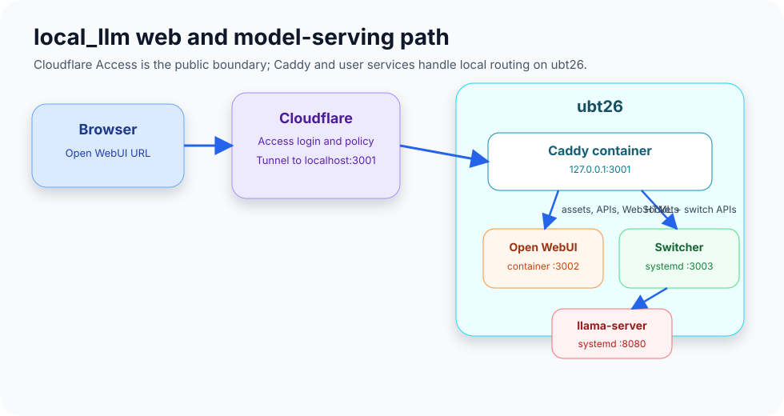
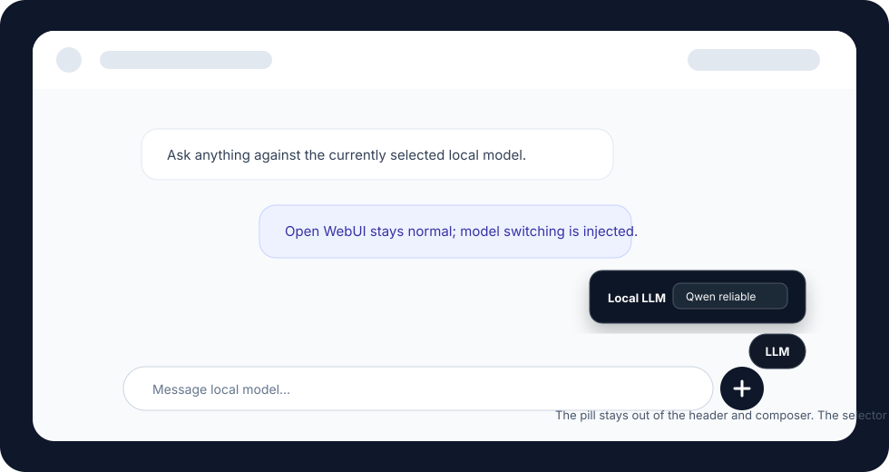

# local_llm

`local_llm` is a small operations repo for running local coding models through `llama.cpp`, OpenCode, and Open WebUI.

The normal setup is split across two machines. Replace the example hostnames with your own:

- The Mac runs OpenCode and the `oc-*` convenience commands.
- A GPU host runs `llama-server`; this deployment uses an Ubuntu 26 server named `ubt26` / `cass.lan` as the tested example.
- Open WebUI is exposed through Cloudflare Access at the public hostname, with Caddy and a local model switcher in front of it.

The repo keeps the local OpenCode wrappers, remote `llama-server` launchers, Open WebUI model switcher, benchmark scripts, and operating notes in one place.



## Features

- One-command OpenCode launchers such as `oc-qwen-reliable --lean` and `oc-qwen-coder-reliable --lean`.
- Model family/profile shortcuts for speed, long-context, reliable, and VRAM-constrained runs.
- Remote `llama-server` startup over SSH, so the Mac can drive models hosted on your GPU box.
- A user-systemd `llama-server.service` that switches models by reading `current-model.env` instead of rewriting unit files.
- A browser model switcher injected into Open WebUI as a compact bottom-right `LLM` pill.
- Caddy routing for Open WebUI WebSockets, static assets, switcher APIs, and HTML injection.
- Open WebUI model-row/read-grant synchronization after a model switch.
- Benchmark helpers for installed KV-cache settings and MTP draft-token tuning.
- Guardrails for local development: ignore rules, pre-commit hooks, gitleaks, shell syntax checks, Python checks, and docs for the model workflow.

Use this when you want one local workflow for:

- Coding in OpenCode against a local OpenAI-compatible `llama.cpp` endpoint.
- Chatting in Open WebUI while switching between installed models from the main page.
- Adding and benchmarking new GGUF launchers without losing track of what is promoted and why.

## Architecture

Runtime services on the GPU host:

| Component | Type | Address | Purpose |
| --- | --- | --- | --- |
| `llama-server.service` | user systemd | `127.0.0.1:8080` | Runs the selected `llama-server` launcher. |
| `local-llm-switcher.service` | user systemd | `127.0.0.1:3003` | Serves switcher APIs and injects the Open WebUI pill. |
| `open-webui` | Docker container | `127.0.0.1:3002` | Open WebUI application and SQLite data volume. |
| `local-llm-caddy` | Docker container | `127.0.0.1:3001` | Front proxy for Open WebUI, WebSockets, and switcher routes. |
| Cloudflare tunnel | external service | `llm.example.com -> http://localhost:3001` | Public entrypoint protected by Cloudflare Access. |

Cloudflare is the public security boundary. The tunnel publishes only Caddy on `localhost:3001`; Open WebUI, the switcher, and `llama-server` stay bound to local/private addresses. Cloudflare Access should enforce identity before a browser reaches Open WebUI, so this repo does not add Basic Auth, bearer-token middleware, or another custom auth proxy in front of the app.



Request flow:

1. Browser opens the Cloudflare hostname.
2. Cloudflare forwards to Caddy on `:3001`.
3. Caddy sends API/assets/WebSockets to Open WebUI on `:3002`.
4. Caddy sends page HTML and `/api/local-llm/*` to the switcher on `:3003`.
5. The switcher injects the `LLM` pill and handles model switching.
6. `llama-server` serves the active model on `:8080`.

The split is intentional. The Python switcher is stdlib-only and can talk to user systemd and Docker from the host. Caddy handles WebSockets, which the stdlib HTTP server should not proxy.

## Install Guide

### 1. Prerequisites

Client machine:

- OpenCode installed.
- SSH access to the model-server host.
- `~/.local/bin` on `PATH`.

Server machine:

- Ubuntu 26 is the tested server OS for the current deployment; other Linux hosts should work if they provide the same systemd, Docker, ROCm, and `llama.cpp` pieces.
- `llama.cpp` built under the chosen `$REMOTE_DIR`.
- ROCm configured for the RX 7900 XT.
- Docker installed for Open WebUI and Caddy.
- User systemd available for `llama-server.service` and `local-llm-switcher.service`.
- Cloudflare tunnel already routing the public hostname to `http://localhost:3001`.

Set these shell variables while following the examples:

```bash
MODEL_HOST=gpu-box.example.lan
MODEL_USER=llmuser
REMOTE_DIR=/home/llmuser/llama.cpp
MODEL_API_BASE=http://gpu-box.example.lan:8080/v1
PUBLIC_LLM_HOST=llm.example.com
```

For this repo's current Ubuntu 26 deployment those values are effectively:

```bash
MODEL_HOST=ubt26
MODEL_USER=cass
REMOTE_DIR=/home/cass/llama.cpp
MODEL_API_BASE=http://cass.lan:8080/v1
PUBLIC_LLM_HOST=llm.example.com
```

### 2. Install Client Commands

Run from this repo on the Mac:

```bash
./installer.sh
```

This installs `oc-local`, `hardware-analyzer`, `model-discovery`, `model-manager`, `update-manager`, and the visible `oc-*` shortcuts into `~/.local/bin`.

Check one command without starting a model:

```bash
oc-qwen-reliable --lean --info
```

### 3. Deploy Server Scripts

Copy launchers, services, Caddy config, and the switcher to the GPU host:

```bash
scp scripts/start2.sh scripts/start3.sh scripts/start4.sh scripts/start5.sh \
  scripts/start6.sh scripts/start7.sh scripts/start8.sh scripts/start9.sh \
  scripts/start10.sh scripts/start11.sh scripts/start12.sh scripts/start14.sh \
  scripts/run-current-model.sh scripts/local-llm-switcher.py \
  scripts/Caddyfile.local-llm scripts/run-local-llm-caddy-container.sh \
  "$MODEL_HOST:$REMOTE_DIR/"

scp docker-compose.yml "$MODEL_HOST:$REMOTE_DIR/docker-compose.yml"

scp scripts/local-llm-switcher.service \
  "$MODEL_HOST:/home/$MODEL_USER/.config/systemd/user/local-llm-switcher.service"

ssh "$MODEL_HOST" "chmod +x '$REMOTE_DIR'/start*.sh '$REMOTE_DIR'/run-current-model.sh '$REMOTE_DIR'/run-local-llm-caddy-container.sh"
```

The `llama-server.service` unit is expected to call `$REMOTE_DIR/run-current-model.sh`. That helper reads `$REMOTE_DIR/current-model.env`, for example:

```bash
REMOTE_SCRIPT=./start11.sh
REMOTE_PROFILE=reliable
```

### 4. Start Systemd Services

```bash
ssh "$MODEL_HOST" 'systemctl --user daemon-reload'
ssh "$MODEL_HOST" 'systemctl --user enable --now llama-server.service local-llm-switcher.service'
ssh "$MODEL_HOST" 'systemctl --user status llama-server.service local-llm-switcher.service --no-pager'
```

`llama-server.service` owns model serving on `:8080`. `local-llm-switcher.service` owns the switch API and HTML injection on `:3003`.

### 5. Start Docker Containers

Preferred container layout is in `docker-compose.yml`. From a full repo checkout, the default Caddyfile mount works as-is:

```bash
docker compose up -d
```

On the GPU host, the deployed files usually live directly in `$REMOTE_DIR`, so point Compose at the deployed Caddyfile path:

```bash
ssh "$MODEL_HOST" "cd '$REMOTE_DIR' && LOCAL_LLM_CADDYFILE=./Caddyfile.local-llm docker compose up -d"
```

It runs:

- `open-webui` on host networking with `PORT=3002` and volume `open-webui:/app/backend/data`.
- `local-llm-caddy` on host networking with `$REMOTE_DIR/Caddyfile.local-llm` mounted read-only.

If Compose is unavailable, start Caddy with the helper:

```bash
ssh "$MODEL_HOST" "'$REMOTE_DIR'/run-local-llm-caddy-container.sh"
```

The old one-container Open WebUI rollback command is kept later in this README for emergencies, but the normal architecture uses both containers plus the switcher service.

### 6. Configure Cloudflare Tunnel And Access

Cloudflare provides the secure public access layer for this stack. The GPU host does not expose Open WebUI, the Python switcher, or `llama-server` directly to the internet. Instead, `cloudflared` creates an outbound tunnel from the GPU host to Cloudflare, and Cloudflare publishes the hostname after applying Access policy checks.

The important boundary is:

```text
Internet browser
  -> Cloudflare Access login and policy check
  -> Cloudflare Tunnel
  -> GPU host localhost:3001
  -> Caddy
```

Everything behind Caddy remains private to the host or LAN:

- `127.0.0.1:3001`: Caddy, the only local service the tunnel should target.
- `127.0.0.1:3002`: Open WebUI container.
- `127.0.0.1:3003`: local-llm-switcher user service.
- `127.0.0.1:8080`: llama.cpp OpenAI-compatible API.

This keeps public authentication outside the app. Cloudflare Access handles login, identity provider checks, device policy, email allowlists, and session lifetime. The switcher stays simple and local-only; it assumes requests reaching it have already passed Cloudflare Access when coming from the public internet.

Do not commit Cloudflare credentials, tunnel tokens, certs, or generated tunnel config to this repo. The durable repo-level fact is only the intended routing shape and operational checks.

Install `cloudflared` on Ubuntu 26:

```bash
ssh "$MODEL_HOST" 'curl -fsSL https://pkg.cloudflare.com/cloudflare-main.gpg | sudo tee /usr/share/keyrings/cloudflare-main.gpg >/dev/null'
ssh "$MODEL_HOST" 'echo "deb [signed-by=/usr/share/keyrings/cloudflare-main.gpg] https://pkg.cloudflare.com/cloudflared any main" | sudo tee /etc/apt/sources.list.d/cloudflared.list >/dev/null'
ssh "$MODEL_HOST" 'sudo apt update && sudo apt install -y cloudflared'
```

Authenticate the tunnel from the GPU host. This opens a browser login flow and stores Cloudflare-managed credentials on that host, not in this repo:

```bash
ssh -t "$MODEL_HOST" 'cloudflared tunnel login'
```

Create a named tunnel and route the DNS hostname. Use your own tunnel and hostname values:

```bash
ssh "$MODEL_HOST" 'cloudflared tunnel create local-llm'
ssh "$MODEL_HOST" "cloudflared tunnel route dns local-llm '$PUBLIC_LLM_HOST'"
```

Create the tunnel config on the GPU host only. Do not copy it back into git because it may sit next to generated credentials:

```bash
ssh "$MODEL_HOST" "mkdir -p ~/.cloudflared && cat >~/.cloudflared/config.yml <<'EOF'
tunnel: local-llm
credentials-file: /home/llmuser/.cloudflared/<TUNNEL_ID>.json
ingress:
  - hostname: llm.example.com
    service: http://localhost:3001
  - service: http_status:404
EOF"
```

Replace `/home/llmuser`, `<TUNNEL_ID>`, and `llm.example.com` on the server with the actual generated values. Keep those values local to the server if they identify your real tunnel.

Install and start the `cloudflared` service. Depending on how you installed the tunnel, this can be a system service:

```bash
ssh "$MODEL_HOST" 'sudo cloudflared service install'
ssh "$MODEL_HOST" 'sudo systemctl enable --now cloudflared'
ssh "$MODEL_HOST" 'sudo systemctl status cloudflared --no-pager'
```

If you prefer a user service, run `cloudflared tunnel run local-llm` under your user systemd setup instead. The critical requirement is that it always forwards the public hostname to `http://localhost:3001` on the GPU host.

The public URL should point at Caddy, not directly at Open WebUI:

```text
$PUBLIC_LLM_HOST -> http://localhost:3001
```

On the GPU host, the Cloudflare tunnel config should route that hostname to `http://localhost:3001`. Keep the tunnel target stable even if Open WebUI moves ports internally; Caddy owns the public local port and routes the rest. A redacted example shape is:

```yaml
ingress:
  - hostname: llm.example.com
    service: http://localhost:3001
  - service: http_status:404
```

Protect the hostname with Cloudflare Access:

- Require your identity provider login before allowing requests to your public LLM hostname.
- Scope the Access application to the Open WebUI hostname, not to a broad wildcard unless that is intentional.
- Prefer explicit user/group/email allow rules and short-lived sessions for a model-control surface.
- Keep Open WebUI, the switcher, and `llama-server` unavailable directly from the public internet.
- Do not put real credentials in this repo; document placeholder values only.
- Use Cloudflare Access policies for public authentication instead of adding custom auth code to `local-llm-switcher.py`.

Why the tunnel points at Caddy instead of Open WebUI:

- Caddy can split routes cleanly between Open WebUI and the switcher.
- Open WebUI WebSocket traffic goes directly to the Open WebUI container.
- HTML document requests pass through the switcher so the `LLM` pill can be injected.
- The public hostname remains stable even if the internal Open WebUI port changes.
- Cloudflare Access remains the only public auth layer.

Useful checks from the GPU host:

```bash
curl -fsS http://127.0.0.1:3001/ >/dev/null
curl -fsS http://127.0.0.1:3001/api/local-llm/current
```

Useful checks from outside the LAN:

```bash
curl -I https://llm.example.com
```

Unauthenticated public requests should be intercepted by Cloudflare Access. Authenticated browser sessions should reach Open WebUI and show the bottom-right `LLM` pill.

### 7. Verify The Stack

```bash
ssh "$MODEL_HOST" 'systemctl --user is-active llama-server.service local-llm-switcher.service'
ssh "$MODEL_HOST" 'docker ps --filter name=open-webui --filter name=local-llm-caddy'
ssh "$MODEL_HOST" 'curl -fsS http://127.0.0.1:8080/v1/models'
ssh "$MODEL_HOST" 'curl -fsS http://127.0.0.1:3001/api/local-llm/current'
ssh "$MODEL_HOST" 'curl -fsS http://127.0.0.1:3001/ >/dev/null'
```

## Concrete Examples

Start the preferred daily OpenCode model:

```bash
oc-qwen-reliable --lean
```

Start code-specialized Qwen Coder:

```bash
oc-qwen-coder-reliable --lean
```

Inspect a profile before launching:

```bash
oc-qwen-coder-reliable --lean --info
```

Run the model server remotely over SSH:

```bash
oc-local qwen reliable --remote "$MODEL_HOST" --user "$MODEL_USER"
```

Switch models from Open WebUI:

1. Open the Cloudflare-protected Open WebUI URL.
2. Tap the bottom-right `LLM` pill.
3. Select a model.
4. The switcher restarts `llama-server.service`, waits for `/v1/models`, syncs Open WebUI model access, and opens a fresh chat pane without prompting.

Probe Open WebUI switcher state directly:

```bash
ssh "$MODEL_HOST" 'curl -fsS http://127.0.0.1:3001/api/local-llm/current'
```

Restart the web side after changing Caddy or Open WebUI:

```bash
ssh "$MODEL_HOST" "cd '$REMOTE_DIR' && docker compose up -d"
ssh "$MODEL_HOST" 'systemctl --user restart local-llm-switcher.service'
```

## Quick Start

Use Qwen3.6 for general local OpenCode work:

```bash
oc-qwen-reliable --lean
```

Use Qwen Coder when code-specialized behavior matters:

```bash
oc-qwen-coder-reliable --lean
```

Use Gemma text-only for comparison:

```bash
oc-gemma-reliable --lean
```

Use Gemma vision when image input matters:

```bash
oc-gemma-vision-reliable --lean
```

Remote usage (SSH):

- By default, `--remote` means: SSH to the given host and run llama-server there.
- Use `--user` to set the SSH username.
- Use `-k` to allow password prompt when key auth is not configured.

```bash
oc-local qwen reliable --remote "$MODEL_HOST" --user "$MODEL_USER" -k
```

Inspect exact settings without starting anything:

```bash
oc-qwen-coder-reliable --lean --info
oc-gemma-vision-reliable --lean --info
```

## Helper Tools

These scripts are installed locally by the manual install commands below. They inspect or maintain this wrapper setup; they do not replace live `llama-server` benchmarking.

### Hardware Analyzer

hardware-analyzer reports the machine it runs on. On the Mac, it reports Mac CPU/RAM and usually cannot see the remote RX 7900 XT. To inspect the ROCm server, run it on the GPU host or use ROCm tools there.

```bash
# Local client hardware summary
hardware-analyzer

# Remote model-server hardware summary
hardware-analyzer --remote "$MODEL_HOST"

# Remote GPU view for the actual model server
ssh "$MODEL_HOST" 'rocminfo | grep -E "Name:|Marketing Name" | head -20'
ssh "$MODEL_HOST" 'rocm-smi --showmeminfo vram --showuse'
```

Use this when deciding whether a model candidate is worth testing before pulling a large GGUF. Treat the output as a starting point; final fit still comes from `llama-server` logs and `oc-*-* --info`.

### Model Discovery

`model-discovery` queries Hugging Face live for GGUF candidates by default, detects the target model-server hardware, and prints already tuned local_llm profiles separately. Use the Hugging Face list as a starting point; final fit still comes from `llama-server` logs and `oc-*-* --info`.

Default results are ranked for the RX 7900 XT: 14B-40B candidates first, unusual sizes next, tiny 1B-9B models demoted as small/test, and 70B+ models demoted as unlikely.

```bash
# Search Hugging Face and show tuned profiles
model-discovery

# Search for a specific model family
model-discovery --query "qwen coder gguf" --limit 10

# Show only profiles already tuned in this repo
model-discovery --installed-only

# Force local-client hardware instead of the remote model host
model-discovery --local

# More detailed tuned-profile output
model-discovery --detailed
```

After discovery suggests a model, verify the actual wrapper profile before running it:

```bash
oc-qwen-coder-reliable --lean --info
oc-gpt-oss-speed --lean --info
oc-qwen-27b-long --lean --info
```

### Model Manager

`model-manager` is the planned workflow helper for model discovery, selection, benchmarking, and acceptance.

```bash
# Discover remote GGUF candidates
model-manager discover --target "remote:$MODEL_HOST" --query "qwen coder gguf"

# Show current model-manager state
model-manager status
```

### Update Manager

update-manager is a compatibility helper. It does not mutate files; use `model-manager` for model workflow lifecycle commands.

```bash
# Show model-manager workflow guidance
update-manager

# Compatibility alias for older local helper workflows
update-manager --config

# Compatibility alias for older model update workflows
update-manager --models

# Inspect model workflow state
model-manager status

# Discover remote GGUF candidates
model-manager discover --target "remote:$MODEL_HOST" --query "qwen coder gguf"

# Inspect a benchmark plan before running lifecycle work
model-manager benchmark --repo <repo> --family <family> --alias <alias> --target "remote:$MODEL_HOST" --dry-run
```

Use the explicit install commands below when you change `scripts/oc-local` or any `scripts/start*.sh` launcher.

## Server Service

The GPU host runs `llama-server` through a user systemd service. The service has a stable `ExecStart` that calls `run-current-model.sh`; `oc-local` updates `current-model.env` and then runs:

```bash
systemctl --user restart llama-server.service
```

The current model selection is mutable and stored on the server in `current-model.env`. For example, the restored Qwen vision service uses:

```bash
REMOTE_SCRIPT=./start11.sh
REMOTE_PROFILE=reliable
```

This avoids rewriting unit files and avoids fighting a root-owned `Restart=always` process.

## Web Switcher

The public Open WebUI path uses three local services on the GPU host:

- Caddy listens on http://127.0.0.1:3001.
- Open WebUI listens on http://127.0.0.1:3002.
- local-llm-switcher listens on http://127.0.0.1:3003.
- Cloudflare stays pointed at port 3001, so the public tunnel does not need to change.
- Caddy routes `/api/local-llm/*` and `/_switcher` to the switcher.
- Caddy routes Open WebUI API, asset, and WebSocket traffic directly to Open WebUI.
- Caddy routes page HTML through the switcher so it can inject the bottom-right `LLM` pill.

This split is intentional. Python's stdlib HTTP server is enough for the switcher API and HTML injection, but it is not a WebSocket reverse proxy. Caddy handles WebSockets so Open WebUI chat updates render correctly.

The injected picker is a compact bottom-right pill that expands into a popover above the pill. It is kept out of the Open WebUI header and composer areas, and injected HTML is served with `Cache-Control: no-store` so browser cache revalidation does not pin an old widget after deployment.

Browser switch flow:

1. The model picker calls `POST /api/local-llm/switch`.
2. The switcher writes `$REMOTE_DIR/current-model.env`.
3. The switcher restarts `llama-server.service`.
4. The switcher waits until `/v1/models` reports the expected alias.
5. The switcher updates Open WebUI's stored selected model.
6. The switcher ensures an Open WebUI model row and read grants exist for that alias.
7. The browser navigates to a fresh chat pane without prompting.

Existing Open WebUI chats keep their own stored model id. Do not force old chats onto a new backend model; use Open WebUI reference/clone/branch features when carrying context across model switches.

Remote launcher aliases must match the switcher allowlist. If a remote `start*.sh` uses a stale `--alias`, switching can time out or leave `llama-server` unreachable from the switcher.

Switcher endpoints:

| Endpoint | Purpose |
| --- | --- |
| `GET /api/local-llm/models` | List allowed launcher/profile choices. |
| `GET /api/local-llm/current` | Show the selected `current-model.env` entry and live llama.cpp model aliases. |
| `POST /api/local-llm/switch` | Write `current-model.env`, restart `llama-server.service`, and wait for the requested alias. |
| `GET /_switcher` | Fallback page using the same APIs when the injected Open WebUI widget is unavailable. |

## Model Workflow

The durable workflow for finding, adding, benchmarking, and promoting models belongs here in the README. Scratch implementation plans under `docs/plans/` and agent workflow notes under `docs/superpowers/` are not durable project docs.

Find candidates:

```bash
model-discovery --query "qwen coder gguf" --limit 10
model-manager discover --target "remote:$MODEL_HOST" --query "qwen coder gguf"
```

Select a candidate for lifecycle tracking:

```bash
model-manager select --repo <hf-repo> --family <family> --alias <alias> --target "remote:$MODEL_HOST"
```

Benchmark before promotion:

```bash
model-manager benchmark --repo <hf-repo> --family <family> --alias <alias> --target "remote:$MODEL_HOST" --dry-run
scripts/bench-mtp-remote.sh <family> <alias>
scripts/bench-installed-kv-remote.sh
```

Promote a model only after a benchmark justifies it:

1. Add or update the matching `scripts/startN.sh` launcher.
2. Add the family/profile mapping in `scripts/oc-local`.
3. Add the model to `scripts/local-llm-switcher.py` if it should appear in Open WebUI.
4. Update the family table and recommendations in this README.
5. Add/update assertions in `test_oc_local.sh`.
6. Deploy the launcher to `$REMOTE_DIR` on the GPU host.
7. Verify the launcher `--alias` exactly matches `/v1/models` and the switcher allowlist.

Keep benchmark result reports in `docs/benchmarks/`. Do not keep one-off implementation plans or agent notes in git.

Inspect or restart the remote services and containers:

```bash
ssh "$MODEL_HOST" 'systemctl --user status local-llm-switcher.service llama-server.service'
ssh "$MODEL_HOST" 'journalctl --user -u local-llm-switcher.service -n 160 --no-pager'
ssh "$MODEL_HOST" 'journalctl --user -u llama-server.service -n 160 --no-pager'
ssh "$MODEL_HOST" 'docker ps --filter name=local-llm-caddy'
ssh "$MODEL_HOST" 'docker logs --tail 120 local-llm-caddy'
ssh "$MODEL_HOST" 'docker ps --filter name=open-webui'
ssh "$MODEL_HOST" 'docker logs --tail 120 open-webui'
ssh "$MODEL_HOST" 'docker restart open-webui'
ssh "$MODEL_HOST" "systemctl --user restart local-llm-switcher.service llama-server.service && '$REMOTE_DIR'/run-local-llm-caddy-container.sh"
```

Probe the switcher, fallback page, and proxied Open WebUI directly on the GPU host:

```bash
ssh "$MODEL_HOST" 'curl -fsS http://127.0.0.1:3001/api/local-llm/current; curl -fsS http://127.0.0.1:3001/_switcher >/dev/null; curl -fsS http://127.0.0.1:3001/ >/dev/null; curl -fsS http://127.0.0.1:3002/ >/dev/null; curl -fsS http://127.0.0.1:3003/api/local-llm/current >/dev/null'
```

Rollback if the proxy fails:

```bash
ssh "$MODEL_HOST" 'docker rm -f local-llm-caddy && systemctl --user disable --now local-llm-switcher.service'
ssh "$MODEL_HOST" 'docker rm -f open-webui && docker run -d --name open-webui --restart unless-stopped --network host -e PORT=3001 -v open-webui:/app/backend/data ghcr.io/open-webui/open-webui:main'
```

## What This Does

`scripts/oc-local`:

- Resolves model family and profile from command name or arguments.
- Starts the matching `llama-server` profile locally or over SSH.
- Waits for the OpenAI-compatible API to become reachable.
- Generates `OPENCODE_CONFIG_CONTENT` with matching context limits.
- Launches OpenCode with the resolved local model id.

llama.cpp launchers:

- `scripts/start2.sh`: Qwen3-Coder 30B A3B Instruct.
- `scripts/start3.sh`: Qwen3.6 35B A3B, vision-enabled with `--mmproj-auto`.
- `scripts/start4.sh`: Gemma 4 31B text-only.
- `scripts/start5.sh`: Gemma 4 31B vision.
- `scripts/start6.sh`: gpt-oss 20B.
- `scripts/start7.sh`: DeepSeek R1 Distill Qwen 32B.
- `scripts/start8.sh`: Qwen3.6 27B dense.
- `scripts/start9.sh`: Qwen3.5 27B Opus reasoning distill benchmark candidate.
- `scripts/start10.sh`: DavidAU Qwen3.6 27B Heretic uncensored code finetune candidate.
- `scripts/start11.sh`: Hauhau Qwen3.6 35B A3B uncensored candidate, vision-enabled with `--mmproj-auto`.

## Command Shape

Symlink style:

```bash
oc-<family>-<profile> --lean
```

Explicit style:

```bash
oc-local <family> <profile> --lean
```

Remote style (SSH):

```bash
oc-local qwen-heretic reliable --remote "$MODEL_HOST" --user "$MODEL_USER" -k
```

`--remote` SSH-targets the model server. Use `--user` to specify the SSH username and `-k` to allow password prompt when key auth is not configured.

Families:

| Family | Purpose | Model id |
| --- | --- | --- |
| `qwen` | Default coding/chat profile with vision projector enabled | `localllm/qwen3.6-35b-a3b-mtp` |
| `qwen-hauhau` | Hauhau Qwen3.6 35B vision-enabled candidate | `localllm/qwen3.6-35b-a3b-hauhau` |
| `qwen-27b` | Qwen3.6 27B dense-thinking comparison; not the responsive daily driver | `localllm/qwen3.6-27b` |
| `qwen-coder` | Code-specialized Qwen Coder | `localllm/qwen3-coder-30b-a3b-instruct` |
| `gemma` | Gemma text-only | `localllm/gemma-4-31b-it` |
| `gemma-vision` | Gemma with vision projector | `localllm/gemma-4-31b-it-vision` |
| `gpt-oss` | OpenAI gpt-oss 20B reasoning model | `localllm/gpt-oss-20b` |
| `deepseek-r1` | DeepSeek R1 Distill Qwen 32B reasoning model | `localllm/deepseek-r1-distill-qwen-32b` |
| `qwen-opus` | Qwen3.5 27B Opus reasoning distill; benchmark candidate, not yet promoted | `localllm/qwen3.5-27b-opus-reasoning` |
| `qwen-heretic` | DavidAU Qwen3.6 27B Heretic uncensored code finetune candidate | `localllm/qwen3.6-27b-heretic-code` |

Profiles:

| Profile | Intent |
| --- | --- |
| `speed` | Smallest practical context for fast startup/use. |
| `fastlong` | Medium context for normal larger tasks. |
| `balanced` | Larger context with more conservative batches. |
| `reliable` | Long-session profile; preferred default for serious work. |
| `tiny` | Lower-quant fallback when VRAM is tight. |

Options:

| Option | Effect |
| --- | --- |
| `--lean` | Removes OpenCode plugins from generated config to reduce prompt overhead. |
| `--dry-run` | Prints machine-readable-ish wrapper actions and generated config. |
| `--info` | Prints full resolved model/server/OpenCode settings and exits. No SSH. No server start. |
| `--remote <host>` | SSH to the given host and run llama-server there instead of locally. |
| `-s <id>`, `--session <id>` | Restarts the selected model on the chosen target, then resumes the OpenCode session with that id. |

Resume an existing OpenCode session on a different local model:

```bash
oc-gpt-oss-speed --lean -s ses_abc123
oc-qwen-coder-reliable --lean --session ses_abc123
```

## Recommended Choices

Qwen 35B defaults are vision-enabled. The default `qwen` family and the `qwen-hauhau` candidate load their multimodal projector with `--mmproj-auto`; use `--info` to inspect the resolved `mmproj=enabled` setting before starting a long session.

Quant, KV Q4/Q5, and MMQ changes remain future benchmark/promotion work. The 2026-05-22 Qwen vision quant benchmark did not justify adding q8 KV launcher flags, changing quant files, or enabling `GGML_HIP_FORCE_MMQ` by default.

| Goal | Command | Why |
| --- | --- | --- |
| Best default local OpenCode | `oc-qwen-reliable --lean` | Fast decode, stable behavior, long context, and vision projector enabled. |
| Qwen dense-thinking comparison | `oc-qwen-27b-reliable --lean` | Dense 27B thinking model; not the responsive daily driver. |
| Qwen dense fastest profile | `oc-qwen-27b-speed --lean` | IQ4, 49k context; fastest stable 27B profile, but still about 30 tok/s decode. |
| Qwen dense reliable | `oc-qwen-27b-reliable --lean` | IQ4, 65k context; more room, but slower prompt eval. |
| Qwen dense long context | `oc-qwen-27b-long --lean` | Q3 96k context; 100k loaded but crashed on generation, 128k OOMed. |
| Code-specialized model | `oc-qwen-coder-reliable --lean` | Full GPU offload at 65k after Q3 profile tuning. |
| Fast Coder test | `oc-qwen-coder-fastlong --lean` | Coder model with smaller 40k context. |
| Gemma text comparison | `oc-gemma-reliable --lean` | Text-only, disables vision projector for VRAM headroom. |
| Gemma vision | `oc-gemma-vision-reliable --lean` | Loads mmproj and uses smaller context/batch. |
| gpt-oss 131k reasoning | `oc-gpt-oss-speed --lean` | Full 131k context, Q8 quant, and high reasoning with the largest tested batch on RX 7900 XT. |
| DeepSeek small-context reasoning | `oc-deepseek-r1-reliable --lean` | Q3 32B reasoning model; fully offloads at 16k but uses almost all VRAM. |
| Benchmark Qwen Opus reasoning | `oc-qwen-opus-reliable --lean` | Candidate from model-discovery; verify fit/perf before trusting. |
| Qwen Heretic quality | `oc-qwen-heretic-reliable --lean` | Q4_K_M, 65k context; best quality profile that completed. |
| Qwen Heretic fastest | `oc-qwen-heretic-speed --lean` | IQ4_XS, 65k context; fastest measured 65k Heretic profile. |
| Qwen Heretic long | `oc-qwen-heretic-fastlong --lean` | IQ3_M, 96k context; benchmark-backed long-context profile. |
| Qwen Heretic 128k stretch | `oc-qwen-heretic-tiny --lean` | IQ2_M, 131k context; only tested profile that reached 128k. |
| Check exact launch settings | `oc-qwen-coder-reliable --lean --info` | Shows quant, context, batch, offload, command, config. |

## Install

Client-side install on the machine running OpenCode:

```bash
# Install using the enhanced installer
./installer.sh

# Or manually install the enhanced components:
install -m 0755 scripts/oc-local ~/.local/bin/oc-local

for profile in speed fastlong balanced reliable tiny; do
  ln -sf ~/.local/bin/oc-local ~/.local/bin/oc-${profile}
done

for family in qwen qwen-27b qwen-coder gemma gemma-vision gpt-oss deepseek-r1 qwen-opus qwen-heretic; do
  for profile in speed fastlong balanced reliable tiny; do
    ln -sf ~/.local/bin/oc-local ~/.local/bin/oc-${family}-${profile}
  done
done

for profile in speed fastlong balanced reliable tiny; do
  ln -sf ~/.local/bin/oc-local ~/.local/bin/oc-coder-${profile}
done

ln -sf ~/.local/bin/oc-local ~/.local/bin/oc-qwen-coder
ln -sf ~/.local/bin/oc-local ~/.local/bin/oc-qwen-27b-long
ln -sf ~/.local/bin/oc-local ~/.local/bin/oc-qwen-27b-96k
ln -sf ~/.local/bin/oc-local ~/.local/bin/oc-qwen36-27b-long
ln -sf ~/.local/bin/oc-local ~/.local/bin/oc-qwen36-27b-96k
ln -sf ~/.local/bin/oc-local ~/.local/bin/oc-coder
ln -sf ~/.local/bin/oc-local ~/.local/bin/oc-code

# Install enhanced components
install -m 0755 scripts/hardware-analyzer.sh ~/.local/bin/hardware-analyzer
install -m 0755 scripts/model-discovery.sh ~/.local/bin/model-discovery
install -m 0755 scripts/model-manager.sh ~/.local/bin/model-manager
install -m 0755 scripts/update-manager.sh ~/.local/bin/update-manager
```

Server-side install on the GPU host:

```bash
scp scripts/start2.sh "$MODEL_HOST:$REMOTE_DIR/start2.sh"
scp scripts/start3.sh "$MODEL_HOST:$REMOTE_DIR/start3.sh"
scp scripts/start4.sh "$MODEL_HOST:$REMOTE_DIR/start4.sh"
scp scripts/start5.sh "$MODEL_HOST:$REMOTE_DIR/start5.sh"
scp scripts/start6.sh "$MODEL_HOST:$REMOTE_DIR/start6.sh"
scp scripts/start7.sh "$MODEL_HOST:$REMOTE_DIR/start7.sh"
scp scripts/start8.sh "$MODEL_HOST:$REMOTE_DIR/start8.sh"
scp scripts/start9.sh "$MODEL_HOST:$REMOTE_DIR/start9.sh"
scp scripts/start10.sh "$MODEL_HOST:$REMOTE_DIR/start10.sh"
scp scripts/start11.sh "$MODEL_HOST:$REMOTE_DIR/start11.sh"
scp scripts/start12.sh "$MODEL_HOST:$REMOTE_DIR/start12.sh"
scp scripts/start14.sh "$MODEL_HOST:$REMOTE_DIR/start14.sh"
scp scripts/run-current-model.sh "$MODEL_HOST:$REMOTE_DIR/run-current-model.sh"
scp scripts/local-llm-switcher.py "$MODEL_HOST:$REMOTE_DIR/local-llm-switcher.py"
scp scripts/Caddyfile.local-llm "$MODEL_HOST:$REMOTE_DIR/Caddyfile.local-llm"
scp scripts/run-local-llm-caddy-container.sh "$MODEL_HOST:$REMOTE_DIR/run-local-llm-caddy-container.sh"
scp scripts/local-llm-switcher.service "$MODEL_HOST:/home/$MODEL_USER/.config/systemd/user/local-llm-switcher.service"

ssh "$MODEL_HOST" "chmod +x '$REMOTE_DIR'/start*.sh '$REMOTE_DIR'/run-current-model.sh '$REMOTE_DIR'/run-local-llm-caddy-container.sh"
ssh "$MODEL_HOST" "systemctl --user daemon-reload && systemctl --user enable --now local-llm-switcher.service && '$REMOTE_DIR'/run-local-llm-caddy-container.sh"
```

## Environment Overrides

| Variable | Default | Purpose |
| --- | --- | --- |
| `OC_LOCAL_REMOTE_HOST` | `ubt26` | SSH target for model server; override for your GPU host. |
| `OC_LOCAL_REMOTE_DIR` | `/home/cass/llama.cpp` | Remote llama.cpp directory; override if your checkout lives elsewhere. |
| `OC_LOCAL_BASE_URL` | `http://cass.lan:8080/v1` | OpenAI-compatible llama.cpp API URL from the client machine; override for your LAN DNS/IP. |
| `OC_LOCAL_API_KEY` | `sk-dummy` | Dummy key for OpenAI-compatible provider. |
| `OC_LOCAL_MODEL` | family-specific | OpenCode model id override. |
| `OC_LOCAL_OUTPUT_LIMIT` | `4096` | OpenCode output token limit. |
| `OC_LOCAL_RESERVED` | `4096` | OpenCode compaction reserve. |
| `OC_LOCAL_WAIT_SECONDS` | `180` | Startup readiness timeout. |

## Operations

Show exactly what will run:

```bash
oc-qwen-reliable --lean --info
oc-qwen-27b-reliable --lean --info
oc-qwen-coder-reliable --lean --info
oc-gemma-reliable --lean --info
oc-gemma-vision-reliable --lean --info
oc-gpt-oss-reliable --lean --info
```

Run without OpenCode to inspect the server directly:

```bash
ssh "$MODEL_HOST" "cd '$REMOTE_DIR' && ./start3.sh reliable"
```

Inspect remote logs:

```bash
ssh "$MODEL_HOST" 'journalctl --user -u llama-server.service -n 160 --no-pager'
ssh "$MODEL_HOST" 'journalctl --user -u llama-server.service -n 300 --no-pager | grep -E "offloaded|KV buffer|eval time|prompt eval|mmproj"'
```

Check active server:

```bash
curl -fsS "$MODEL_API_BASE/models"
```

Run a tiny API probe:

```bash
curl -fsS "$MODEL_API_BASE/chat/completions" \
  -H 'Content-Type: application/json' \
  --data '{"model":"qwen3.6-35b-a3b-hauhau","messages":[{"role":"user","content":"Reply with exactly: ok"}],"max_tokens":8,"temperature":0}'
```

## Verification

```bash
python3 -m py_compile scripts/local-llm-switcher.py
for script in scripts/oc-local scripts/model-manager.sh scripts/update-manager.sh scripts/model-discovery.sh scripts/hardware-analyzer.sh scripts/bench-mtp-remote.sh installer.sh scripts/start3.sh scripts/start8.sh scripts/start9.sh scripts/start10.sh scripts/start11.sh scripts/start12.sh scripts/start14.sh scripts/run-current-model.sh scripts/run-local-llm-caddy-container.sh scripts/bench-installed-kv-remote.sh test_oc_local.sh; do bash -n "$script" || exit 1; done
./test_oc_local.sh
shellcheck scripts/oc-local scripts/bench-mtp-remote.sh installer.sh scripts/start3.sh scripts/start8.sh scripts/start9.sh scripts/start10.sh scripts/start11.sh scripts/start12.sh scripts/start14.sh scripts/run-current-model.sh scripts/bench-installed-kv-remote.sh test_oc_local.sh
ssh "$MODEL_HOST" 'systemctl --user is-active local-llm-switcher.service llama-server.service; docker ps --filter name=local-llm-caddy --format "{{.Names}} {{.Status}}"; curl -fsS http://127.0.0.1:3001/api/local-llm/current; curl -fsS http://127.0.0.1:3001/ >/dev/null; curl -fsS http://127.0.0.1:3002/ >/dev/null; curl -fsS http://127.0.0.1:3003/api/local-llm/current >/dev/null'
oc-qwen-coder-reliable --lean --info
oc-gemma-vision-reliable --lean --info
oc-gpt-oss-reliable --lean --info
```

## Troubleshooting

### Slow Decode

Check for CPU-offloaded layers or CPU KV:

```bash
ssh "$MODEL_HOST" 'journalctl --user -u llama-server.service -n 300 --no-pager | grep -E "offloaded|CPU KV|KV buffer|eval time"'
```

If decode drops hard, prefer a profile with full GPU offload over a higher quant. For Coder, `UD-Q3_K_XL` reliable is faster than old `IQ4_XS` reliable because it keeps all layers on GPU.

### OOM At Startup

Use `--info` to see quant/context/batch:

```bash
oc-gemma-reliable --lean --info
```

Then choose a smaller profile:

```bash
oc-gemma-balanced --lean
oc-gemma-tiny --lean
```

### Gemma Vision OOM

Vision loads mmproj and costs extra VRAM. Use the `gemma-vision` profiles for image tasks, and keep normal Gemma text on `gemma` because it passes `--no-mmproj`.

### Model Mismatch

Use `--info` and compare `model=`, `alias=`, and `/v1/models`:

```bash
oc-qwen-coder-reliable --lean --info
curl -fsS "$MODEL_API_BASE/models"
```

### Remote API Not Reachable

Check SSH and local URL separately:

```bash
ssh "$MODEL_HOST" 'curl -fsS http://127.0.0.1:8080/v1/models'
curl -fsS "$MODEL_API_BASE/models"
```

### OpenCode Tool Calls

`tool_call` is disabled on purpose. If testing local tool calls, verify the model emits real OpenAI tool-call objects, not raw `<function=...>` text.
